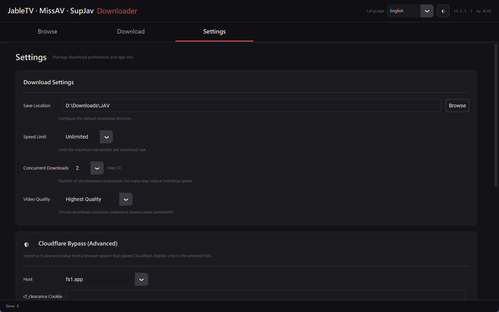

<p align="center">
  
  
  
  
</p>

<h1 align="center">JableTV & MissAV Downloader GUI 2026</h1>
<p align="center"><strong>by ALOS</strong></p>

<p align="center">
  <a href="./README.md">繁體中文</a> ｜ English
</p>

---

## Screenshots

### JableTV Browse
<p align="center">
  
</p>

### MissAV Browse
<p align="center">
  
</p>

### Download Manager
<p align="center">
  
</p>

### Settings
<p align="center">
  
</p>

---

## Features

- **Built-in Browser** — Browse video categories and search directly within the app, with full pagination
- **Multi-Select Download** — Check multiple videos in the browse panel, send to download queue in one click
- **10 Parallel Downloads** — Download up to 10 videos simultaneously; extras auto-queue
- **Speed Rate Limiting** — Configurable bandwidth limit (1/2/5/10/15 MB/s or unlimited)
- **Real-Time Progress** — Individual progress, speed & status for each download
- **Smart Clipboard** — Auto-detects video URLs copied to clipboard
- **Import from File** — Batch-import URLs from `.txt` / `.csv` files
- **Open Folder** — One-click to open the download destination folder
- **Auto Merge** — Automatically merges TS segments into a complete MP4 after download
- **Resume Support** — Cancelled downloads can be restarted; completed segments are preserved
- **High DPI Support** — Automatically adapts to high-resolution displays for crisp UI
- **Settings Tab** — Configure download speed, save location, and more
- **Portable Windows Build** — Pre-packaged `.exe`, no Python installation needed

## Supported Sites

| Site | Browse | Search | Download |
|------|:------:|:------:|:--------:|
| [Jable.tv](https://jable.tv) | ✅ | ✅ | ✅ |
| [MissAV](https://missav.ai) | ✅ | ✅ | ✅ |
| Other M3U8 sites | — | — | ✅ |

## Quick Start

### 🖥️ Windows Users (Recommended)

Go to **[Releases](../../releases)** and download the latest `windowsGUI.exe`. Double-click to run — **no Python installation needed**.

### 🐍 macOS / Linux / Other Platforms

```bash
# 1. Make sure Python 3.8+ is installed
python --version

# 2. Install dependencies
pip install -r requirements.txt

# 3. Launch GUI
python main.py

# 4. CLI mode (optional)
python main.py -nogui True
```

## Usage

1. **Browse Tab** — Pick a site & category, browse thumbnails with pagination, select videos, click "Download Selected"
2. **Download Tab** — Paste video URLs or import from file, click "Download All"
3. **Queue Management** — Active downloads show progress; pending items auto-start
4. **Settings Tab** — Configure speed limit, save location
5. **Open Folder** — Click the folder button to view downloaded videos
6. **Cancel / Cancel All** — Stop any or all downloads at any time

## Technical Details

- M3U8 stream protocol parsing & multi-threaded download
- AES-128 encrypted stream auto-decryption
- Automatic TS segment merging to MP4 (no FFmpeg required)
- Token-bucket rate limiter shared across all parallel downloads
- `ThreadPoolExecutor` for parallel download management
- Thread-safe Tkinter queue design for GUI updates
- Per-Monitor DPI V2 support for high-resolution displays

---

## Disclaimer

> **This tool is for educational and technical research purposes only.** Users must comply with local laws and respect content copyrights. The developer assumes no legal responsibility for any consequences arising from the use of this tool. Do not use this tool for any illegal or infringing purposes.

## Credits

Based on [hcjohn463/JableDownload](https://github.com/hcjohn463/JableDownload) and [AlfredoUen/JableTV](https://github.com/AlfredoUen/JableTV).

## Author

**ALOS** — [GitHub](https://github.com/Alos21750)

## License

[Apache License 2.0](LICENSE)
