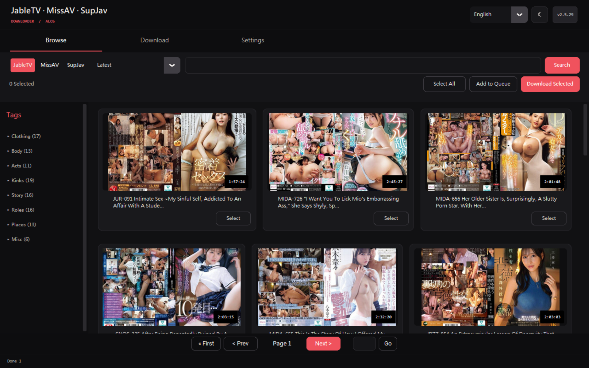
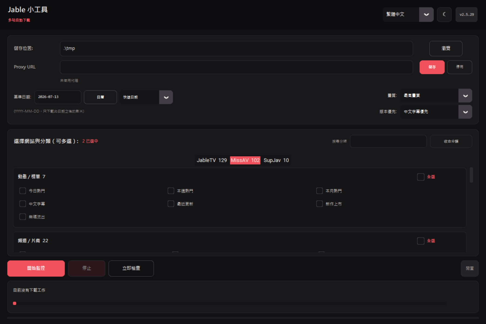
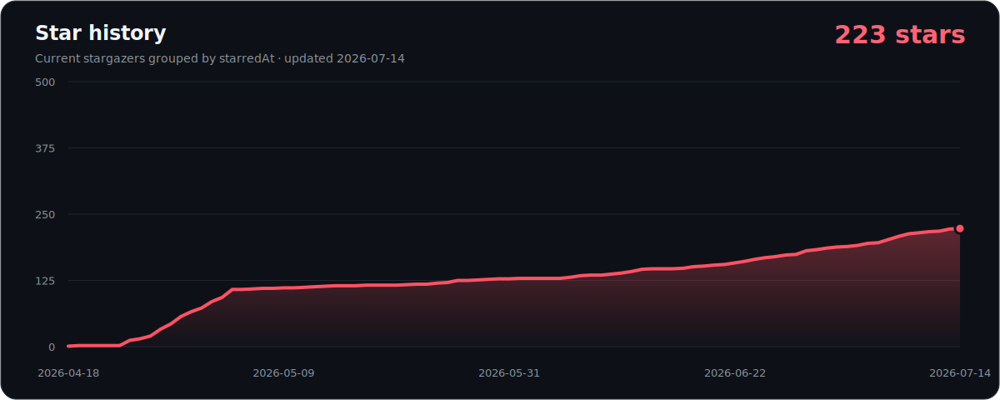

<p align="center">
  <strong>繁體中文</strong> · <a href="./README.en.md">English</a>
</p>

<h1 align="center">JableTV Downloader</h1>

<p align="center">
  JableTV、MissAV、SupJav 的桌面下載器與自動監控工具。<br />
  想自己瀏覽挑片，用 <strong>Modern</strong>；想依分類持續追新，用 <strong>SmallTool</strong>。
</p>

<p align="center">
  <a href="https://github.com/Alos21750/JableTV-MissAV-Downloader-GUI-2026/releases/latest"></a>
  <a href="https://github.com/Alos21750/JableTV-MissAV-Downloader-GUI-2026/releases"></a>
  <a href="https://github.com/Alos21750/JableTV-MissAV-Downloader-GUI-2026"></a>
  <a href="./LICENSE"></a>
  <a href="https://github.com/Alos21750/JableTV-MissAV-Downloader-GUI-2026/pkgs/container/jabletv"></a>
</p>

<p align="center">
  <strong><a href="https://github.com/Alos21750/JableTV-MissAV-Downloader-GUI-2026/releases/latest/download/JableTV_Modern.exe">下載 Modern</a></strong>
  ·
  <strong><a href="https://github.com/Alos21750/JableTV-MissAV-Downloader-GUI-2026/releases/latest/download/Jable_smalltool.exe">下載 SmallTool</a></strong>
  ·
  <a href="https://github.com/Alos21750/JableTV-MissAV-Downloader-GUI-2026/releases/latest">查看最新版本</a>
</p>

<p align="center">
  
</p>

## 先選一個工具

| 需求 | 建議 | 操作方式 |
|---|---|---|
| 想瀏覽、搜尋、逐片挑選 | **JableTV_Modern.exe** | 看片卡、複選、加入佇列或直接下載 |
| 想追蹤特定分類的新片 | **Jable_smalltool.exe** | 選網站、分類、日期與版本優先，開始監控 |
| 想在 NAS／伺服器無介面執行 | **Docker / CLI** | 傳入一個或多個網址，或掛載 `urls.txt` |

不確定時先下載 **Modern**。兩個 Windows 執行檔都免安裝 Python，Release 版本已包含 ffmpeg。

## Windows：30 秒開始

1. 下載 [JableTV_Modern.exe](https://github.com/Alos21750/JableTV-MissAV-Downloader-GUI-2026/releases/latest/download/JableTV_Modern.exe) 或 [Jable_smalltool.exe](https://github.com/Alos21750/JableTV-MissAV-Downloader-GUI-2026/releases/latest/download/Jable_smalltool.exe)。
2. 把檔案放在可寫入的資料夾，直接雙擊執行。
3. 首次開啟選擇語言；之後可隨時切換繁體中文、简体中文、English、日本語與明／暗主題。

若 Windows SmartScreen 出現提醒，請先確認檔案來自本專案的 **Releases**，再選「其他資訊」→「仍要執行」。

## Modern：瀏覽、挑選、下載

1. 在「瀏覽」選 JableTV、MissAV 或 SupJav，再選分類或輸入關鍵字。
2. 勾選多部影片後加入佇列，或直接下載選取項目。
3. 也可在「下載」貼上網址，或從 `.txt` / `.csv` 匯入多個網址。
4. 在「設定」調整儲存位置、畫質、並行數、速度上限、AI 字幕與 Proxy。

| 能力 | 現行行為 |
|---|---|
| 下載佇列 | 每項顯示狀態、進度與速度；佇列會保存，失敗項目可單獨重試 |
| 並行下載 | 預設 2，最多 10 個工作 |
| 畫質偏好 | 最高、1080p、720p、480p、360p、最低；實際可用畫質依來源而定 |
| AI 字幕 | 不產生、日文、英文、繁中或三語；輸出為播放器可切換的同名 SRT |
| 網址操作 | 剪貼簿偵測、手動貼上、文字／CSV 批次匯入 |
| Proxy | 程式內 HTTP、HTTPS、SOCKS4、SOCKS5；不修改 Windows 全域代理 |
| 更新 | 背景檢查 GitHub Release，有新版時由使用者確認後更新 |

## SmallTool：依分類自動追新

<p align="center">
  
</p>

1. 選擇儲存位置；若不選，會在執行檔旁自動建立 `tmp`。
2. 用日曆選基準日期，或使用「昨天、1／2／3／6 個月前」快捷選項。
3. 選畫質與版本優先：中文字幕、無碼／流出、一般版、英文字幕、馬賽克減弱。
4. 選 AI 字幕：不產生、日文、英文、繁中，或一次產生三語。
5. 在三個網站分頁搜尋並勾選分類；支援群組全選。
6. 按「開始監控」。分類區會自動收合，進度區會顯示正在掃描或產生字幕的階段。

| 網站 | 可選目標數 | 分組內容 |
|---|---:|---|
| JableTV | 129 | 動態／榜單、主分類與標籤群組 |
| MissAV | 102 | 動態／榜單、分類／標籤、片商群組 |
| SupJav | 10 | 動態／榜單與主要分類 |

SmallTool 每 24 小時自動檢查，也可按「立即檢查」。同一番號跨分類或跨網站重複時，會優先保留符合使用者版本偏好的候選；無法可靠辨識番號時只按完全相同網址去重，不猜測合併。

下載記錄優先存於執行檔旁的 `.Jable_smalltool`；若該位置不可寫，會改用 `%APPDATA%\JableTV Downloader\smalltool`。

## AI 生成字幕

- 兩個 Windows GUI 都可在下載前選擇 **不產生／日文／英文／繁中／三語**。完成後會在影片旁建立 `.ja.srt`、`.en.srt`、`.zh-TW.srt`，不修改原始 MP4。
- 日文辨識使用官方 [whisper.cpp](https://github.com/ggml-org/whisper.cpp) 在本機執行；首次使用會下載經 SHA-256 驗證、約 60 MB 的 [multilingual base-q5_1 模型](https://huggingface.co/ggerganov/whisper.cpp/blob/main/ggml-base-q5_1.bin) 與[官方 Silero VAD](https://huggingface.co/ggml-org/whisper-vad/tree/main)。目前以日語音軌為來源，VAD 會略過沒有語音的區段。
- 英文與繁中只把辨識後的字幕文字送到免金鑰 Google 翻譯端點，影片與音訊不會上傳。這條免費路徑沒有服務保證；失敗時影片與日文 SRT 仍會保留，介面會明確顯示並允許重試。
- 產生速度取決於 CPU、影片長度與實際語音比例；三語共用同一次本機語音辨識。

## 支援範圍

| 網站 | Modern 瀏覽／搜尋／下載 | SmallTool 分類監控 | Docker／CLI 網址下載 |
|---|:---:|:---:|:---:|
| JableTV | ✓ | ✓ | ✓ |
| MissAV | ✓ | ✓ | ✓ |
| SupJav | ✓ | ✓ | ✓ |

網站與 CDN 可能隨時調整；若某站失效，請先確認已使用最新版，再附上可重現資訊開 Issue。

## 從原始碼執行

需要 **Python 3.10+** 與 Tk。舊 README 的 Python 3.8+ 已不符合目前原始碼語法需求。

```bash
git clone https://github.com/Alos21750/JableTV-MissAV-Downloader-GUI-2026.git
cd JableTV-MissAV-Downloader-GUI-2026
python -m pip install -r requirements.txt

# 完整 GUI
python main.py

# 自動監控工具
python jable_smalltool.py

# 單一網址、無 GUI
python main.py --nogui --url "https://jable.tv/videos/example/"
```

Linux 若未內建 Tk，請先用系統套件管理器安裝 `python3-tk`。macOS／Linux 是原始碼執行方式；Windows Release 才提供免安裝 EXE。

## Docker / NAS

公開映像為 `ghcr.io/alos21750/jabletv:latest`，GitHub Actions 會建置 amd64 與 arm64。

```bash
# 下載單一網址；把主機資料夾掛載到 /downloads
docker run --rm -v "/path/to/downloads:/downloads" \
  ghcr.io/alos21750/jabletv:latest "https://jable.tv/videos/example/"

# docker compose：直接傳網址
docker compose run --rm jabletv "https://jable.tv/videos/example/"

# 或把網址逐行放進 ./downloads/urls.txt
docker compose run --rm jabletv
```

可用環境變數：

| 變數 | 用途 |
|---|---|
| `RESOLUTION` | `highest`、`1080`、`720`、`480`、`360`、`lowest` |
| `URL` / `URLS` | 傳入一個或多個網址 |
| `URLS_FILE` | 網址清單；預設 `/downloads/urls.txt` |
| `DOWNLOAD_DIR` | 容器內儲存位置；預設 `/downloads` |

Docker 是無介面、執行完即結束的下載工作，不包含 Modern 或 SmallTool GUI。

## 遇到問題

開 [GitHub Issue](https://github.com/Alos21750/JableTV-MissAV-Downloader-GUI-2026/issues/new) 時，請提供：

- App 版本、使用的工具與作業系統。
- 網站與可重現網址，以及預期／實際結果。
- 若程式閃退，附上執行檔旁的 `crash_log.txt` 或 `crash_native.log`。
- 不要上傳 Cookie、Proxy 帳密、Token 或其他私密值。

需要 Proxy 時，可在 Modern「設定」或 SmallTool 頂部輸入；設定由兩個 GUI 共用，只作用於本程式。

## Stars 與專案活動

<p align="center">
  
</p>

圖表由本 repo 的 GitHub Actions 使用唯讀 repository token 取得目前 stargazers 的 `starredAt` 時間後產生；不請求或輸出帳號名稱。只有資料或圖表格式改變時才更新。曲線反映「目前仍按 Star 的帳號」之加入日期，已取消 Star 的帳號不在資料中。

<details>
<summary>為什麼不再使用舊的 api.star-history.com 圖片？</summary>

GitHub 在 2026 年 7 月限制 stargazer 清單存取，舊的匿名 Star History 圖片端點因而失效。這個專案改用自身 GitHub Actions 權限生成靜態 SVG，避免 README 留下壞圖，也不把 Token 放進 README。參考：[GitHub 公告](https://github.blog/changelog/2026-06-30-upcoming-access-restrictions-to-public-api-endpoints-and-ui-views/) · [Star History 說明](https://www.star-history.com/blog/github-stargazer-api-restriction/)

</details>

## 授權與使用責任

程式碼採 [Apache License 2.0](./LICENSE)。本工具僅供合法的個人與研究用途；請遵守所在地法律、網站條款與內容權利，只下載你有權取得的內容。

版本變更與已修復問題請看 [Releases](https://github.com/Alos21750/JableTV-MissAV-Downloader-GUI-2026/releases)。

<p align="center">Built and maintained by <a href="https://github.com/Alos21750">ALOS</a>.</p>
