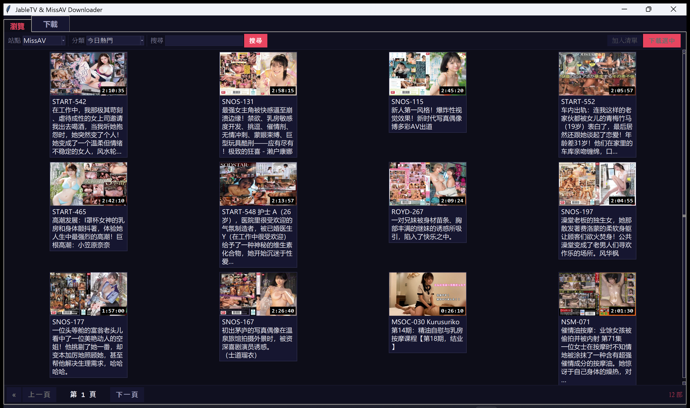
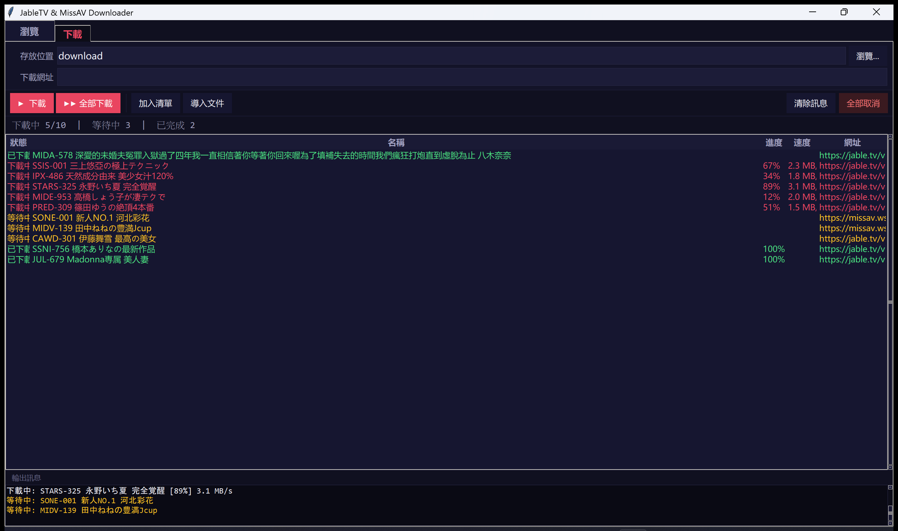

<p align="center">
  
  
  
  
</p>

<h1 align="center">JableTV & MissAV Downloader GUI 2026</h1>

<p align="center">
  繁體中文 ｜ <a href="./README.md">English</a>
</p>

---

## 螢幕截圖

### JableTV 瀏覽頁面
<p align="center">
  
</p>

### MissAV 瀏覽頁面
<p align="center">
  
</p>

### 下載管理
<p align="center">
  
</p>

---

## 功能特色

- **內建瀏覽器** — 直接在應用程式內瀏覽影片分類、搜尋關鍵字，支援翻頁瀏覽
- **多選下載** — 在瀏覽頁面勾選多部影片，一鍵送入下載佇列
- **10 路並行下載** — 同時下載最多 10 部影片，超出自動排隊等候
- **速度限制** — 可設定頻寬限制（1/2/5/10/15 MB/s 或無限制）
- **即時進度顯示** — 每部影片獨立顯示下載進度、速度、狀態
- **智慧剪貼簿** — 複製影片網址自動偵測並加入佇列
- **匯入文字檔** — 從 `.txt` / `.csv` 批量匯入網址
- **一鍵開啟資料夾** — 下載完成後直接開啟存放資料夾
- **自動合併影片** — 下載完成後自動合併 TS 片段為完整 MP4
- **斷點續傳** — 取消後可重新下載，已完成的片段不會重複下載
- **高 DPI 支援** — 自動適配高解析度螢幕，介面清晰銳利
- **設定頁面** — 可調整下載速度、儲存位置等設定
- **Windows 免安裝** — 提供打包好的 `.exe` 執行檔，不需安裝 Python

## 支援網站

| 網站 | 瀏覽 | 搜尋 | 下載 |
|------|:----:|:----:|:----:|
| [Jable.tv](https://jable.tv) | ✅ | ✅ | ✅ |
| [MissAV](https://missav.ai) | ✅ | ✅ | ✅ |
| 其他 M3U8 網站 | — | — | ✅ |

## 快速開始

### 🖥️ Windows 使用者（推薦）

前往 **[Releases](../../releases)** 頁面，下載最新版 `windowsGUI.exe`，雙擊即可執行，**不需要安裝 Python**。

### 🐍 macOS / Linux / 其他平台

```bash
# 1. 確認已安裝 Python 3.8+
python --version

# 2. 安裝相依套件
pip install -r requirements.txt

# 3. 啟動圖形介面
python main.py

# 4. 命令列模式（可選）
python main.py -nogui True
```

## 使用說明

1. **瀏覽分頁** — 選擇網站與分類，瀏覽影片縮圖，可翻頁、搜尋，勾選後點擊「下載選中」
2. **下載分頁** — 貼上影片網址或從檔案匯入，點擊「全部下載」
3. **佇列管理** — 下載中的項目會顯示進度；等候中的項目排隊自動執行
4. **設定分頁** — 調整速度限制、儲存位置
5. **開啟資料夾** — 點擊「開啟資料夾」按鈕直接查看下載的影片
6. **取消 / 全部取消** — 可隨時中止下載任務

## 技術細節

- M3U8 串流協定解析與多執行緒下載
- AES-128 加密串流自動解密
- 自動合併 TS 片段為 MP4（無需 FFmpeg）
- Token-bucket 速率限制器，所有並行下載共用
- `ThreadPoolExecutor` 管理並行下載
- Tkinter 主執行緒安全佇列設計
- Per-Monitor DPI V2 高解析度支援

---

## 免責聲明

> **本工具僅供學習與技術研究用途。** 使用者應遵守當地法律法規，尊重內容版權。開發者不對任何因使用本工具而產生的法律責任負責。請勿將本工具用於任何非法或侵權用途。

## 致謝

基於 [hcjohn463/JableDownload](https://github.com/hcjohn463/JableDownload) 及 [AlfredoUen/JableTV](https://github.com/AlfredoUen/JableTV)。

## 授權

[Apache License 2.0](LICENSE)
